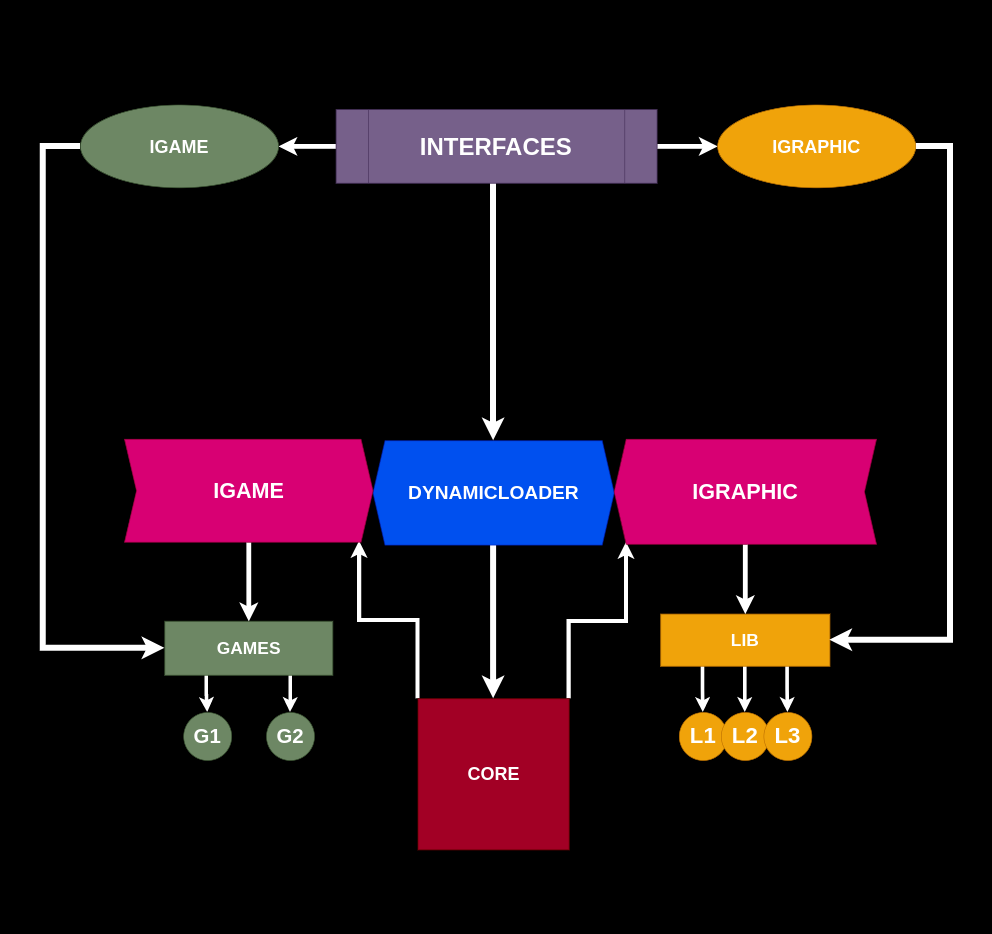

# Arcade 🕹️

Welcome to **Arcade**.

Where the classic games of Snake and Nibbler are brought to life using modern programming techniques and libraries.

This project showcases the use of dynamic loading to seamlessly switch between graphics libraries and game mechanics.

## Language and Tools 🛠️


- **Language:** C++
- **Libraries:** nCurses, SDL2, SFML
- **Dynamic Loader:** Custom implementation for efficient library management
- **Compilation:** Via Makefile, including `re`, `clean`, and `fclean` rules.
- **Binary Name:** arcade

## Project Overview 🔎

The essence of this project lies in its ability to **dynamically load different graphic libraries and game modules at runtime**.

Utilizing nCurses, SDL2, and SFML, this project demonstrates the flexibility and power of dynamic loading in creating engaging game experiences.

## How Arcade Works
Arcade consists of three main components: `Core`, `Games`, and `Graphics`.

- Core: Manages all processes.
- Graphics and Games: Loaded by the Core with the help of a Dynamic Loader.
- Libraries: Arcade includes 3 graphics libraries - nCurses, SDL2, and SFML.
- Games: Features two games - Nibble and Snake.

### Modularity and Customization
- Core Customization: You can use your own Core if it employs a Dynamic Loader to load selected libraries.
- Adding Games/Graphics: Add new games or graphics to the respective directories and update games.txt or graphics.txt to ensure availability.

### Score Management
- Scores are automatically redirected to `Scores.txt` in the `Scores` directory, formatted as `USER_NAME/GAME/SCORE`.
- Documentation

### Documentation
- A detailed diagram of the architecture



## Key Controls 🔑
#### Change Graphic Library
- H for previous graphic library.
- J for next graphic library.

#### Change Game
- B for previous game.
- N for next game.

### Dynamic Loader Class

The `DynamicLoader` class is central to this project, facilitating the dynamic loading of graphic libraries and game modules.

This implementation enhances the project's flexibility and allows for the addition of new features or libraries with minimal changes to the core codebase.


- **Custom Dynamic Loader (`DynamicLoader.hpp`):** A robust dynamic loader is implemented to manage the loading and unloading of different graphic libraries and game modules.


```cpp
namespace arcade {
    template <class T>
    class DynamicLoader {
        public:
            using FunctionPtr = T*(*)(bool o);

            DynamicLoader() : _handle(nullptr) {}

            ~DynamicLoader() {
                if (this->_handle) dlclose(this->_handle);
            }

            std::unique_ptr<T> loadPlugin(std::string path, bool open_window = true) {
                if (this->_handle != nullptr) {
                    dlclose(this->_handle);
                    this->_handle = nullptr;
                }
                if (!(this->_handle = dlopen(path.c_str(), RTLD_LAZY)))
                    throw std::runtime_error("dlopen failed: " + std::string(dlerror()));
                this->_create = reinterpret_cast<FunctionPtr>(dlsym(this->_handle, "createIt"));
                if (!this->_create) throw std::runtime_error("dynload: can't create instance");
                return std::unique_ptr<T>(this->_create(open_window));
            }

            void *getSym(std::string sym) {
                void *ret = nullptr;
                if (this->_handle) ret = dlsym(this->_handle, sym.c_str());
                return ret;
            }

        private:
            void *_handle;
            FunctionPtr _create;
    };
}
```

Purpose of `DynamicLoader`:
- The DynamicLoader class is designed to dynamically load and unload shared libraries at runtime.
- It allows the arcade games to switch between different graphic libraries (like nCurses, SDL2, SFML) without needing to restart the program.
- The loader handles the management of shared library handles and the creation of plugin instances, ensuring efficient resource usage and error handling.

### Game Features

- **Snake Game:** Navigate the snake, avoid obstacles, and consume items to grow longer.
- **Nibbler Game:** A twist on the classic Snake game with additional mechanics and challenges.
- **Graphics Libraries:** Experience the games with different visual styles, thanks to the integration of nCurses, SDL2, and SFML.


## Preview 📸


## Installation and Usage 💾

1. **Compile the Project:**
   - Navigate to the root directory.
   - Run `make` to compile the project with all necessary libraries.

2. **Running the Games:**
   - Execute the binary with a library `./arcade lib/arcade_sfml.so`.
   - Switch between Snake and Nibbler using designated commands.
   - Change graphics libraries on the fly to experience different visual styles.

For detailed guidelines and command references, refer to `arcade_games.pdf`.

## License ⚖️

This project is released under the MIT License. See `LICENSE` for more details.